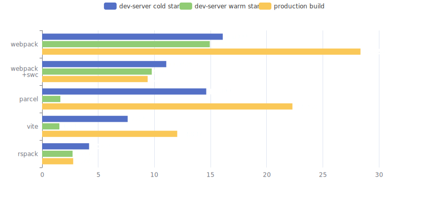

# Front-end Builder Benchmark



## Standard

The front-end builder must match the following standard

- It is actively maintained. (at least 1 release in last 6 month)
- It is able to build production assets.
- It has a dev server with HMR.
- It supports common technology like Sass, LESS, CSS modules, code splitting.
- It supports plugins.
- It does NOT restrict UI framework to use.
- It does NOT bundle unnecessary runtime, like Redux.

## Candidates

- webpack
- parcel
- vite
- rspack

## Unqualified

- esbuild, doesn't support HMR.
- swc/swcpack, doesn't support HMR.
- create-react-app/react-scripts, only supports React.
- icejs and umijs, only supports React and has too many runtime.
- turbopack, only supports Next.js.

## Test Code Base

- 420 React components
- 420 css files
- 20 code splitting bundles
- react & react-dom 18
- react-router-dom 6
- @mui/material 5
- echarts 5
- typescript 5

## Test Script

```
node scripts/benchmark.js
```

## Test Device

```
$ npx envinfo --system --npmPackages @rspack/cli,vite,parcel,webpack,@swc/core,esbuild
  System:
    OS: macOS 13.2.1
    CPU: (12) x64 Intel(R) Core(TM) i7-9750H CPU @ 2.60GHz
    Memory: 1.07 GB / 16.00 GB
    Shell: 5.8.1 - /bin/zsh
  npmPackages:
    @rspack/cli: ^0.1.2 => 0.1.2
    @swc/core: ^1.3.42 => 1.3.42
    parcel: ^2.8.3 => 2.8.3
    vite: ^4.2.1 => 4.2.1
    webpack: ^5.76.3 => 5.76.3
```
